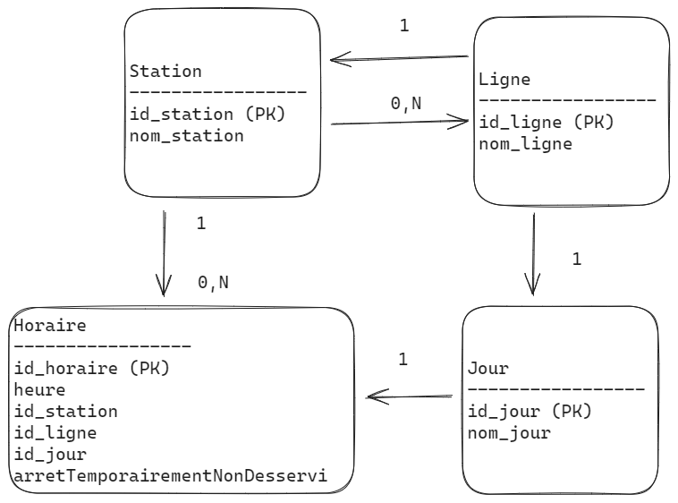

# Projet SQL - Kicéo Transport en Commun

## Introduction
Ce projet modélise une partie de la base de données de la société Kicéo, responsable des transports en commun à Vannes. L'objectif est de stocker et récupérer les horaires des lignes de bus, en mettant particulièrement l'accent sur les horaires de la ligne 2 aux arrêts sélectionnés en semaine.

## Table des matières

1. [Introduction](#introduction)
2. [Instructions](#instructions)
    - [Utilisation des Scripts SQL](#utilisation-des-scripts-sql)
    - [Conception](#conception)
        - [Dictionnaire des données](#dictionnaire-des-données)
        - [Modèle Conceptuel des Données (MCD)](#modèle-conceptuel-des-données-mcd)
    - [Implémentation DDL](#implémentation-ddl)
    - [Insertion de Données](#insertion-de-données)
    - [Requêtes](#requêtes)
        - [Afficher la table des horaires à l'arrêt Madelaine](#1-afficher-la-table-des-horaires-à-larrêt-madelaine)
        - [Afficher le parcours complet de la ligne 2 Direction Kersec](#2-afficher-le-parcours-complet-de-la-ligne-2-direction-kersec)
        - [Modifier le schéma pour prendre en compte l'arrêt non desservi temporairement](#3-modifier-le-schéma-pour-prendre-en-compte-larrêt-non-desservi-temporairement)
        - [Afficher le message "Arrêt temporairement non desservi" à l'arrêt Petit Tohannic](#4-afficher-le-message-arrêt-temporairement-non-desservi-à-larrêt-petit-tohannic)
        - [Mettre à jour l'arrêt Petit Tohannic et afficher le message complet](#5-mettre-à-jour-larrêt-petit-tohannic-et-afficher-le-message-complet)
        - [Ajouter la ligne 2 dans la direction opposée Direction P+R Ouest](#6-ajouter-la-ligne-2-dans-la-direction-opposée-direction-p-r-ouest)
        - [Afficher pour chaque ligne, le parcours complet avec les arrêts temporairement non desservis](#7-afficher-pour-chaque-ligne-le-parcours-complet-avec-les-arrêts-temporairement-non-desservis)
3. [Remarques](#remarques)
4. [Références](#références)

## Instructions

### Utilisation des Scripts SQL

1. Clonez ce dépôt : `git clone <lien_du_dépôt>`
2. Accédez au répertoire du projet : `cd <répertoire_du_projet>`
3. Exécutez le script schema.sql : `mysql -u nom_utilisateur -p < schema.sql`
4. Exécutez le script data.sql : `mysql -u nom_utilisateur -p < data.sql`
5. Exécutez le script requetes.sql : `mysql -u nom_utilisateur -p < requetes.sql`

### Conception

#### Dictionnaire des données
*Le dictionnaire des données pour le projet Kicéo Transport en Commun comprend les éléments suivants :*

    - Stations:
    ID_Station: Identifiant unique de la station (clé primaire).
    Nom_Station: Nom de la station.

    - Lignes:
    ID_Ligne: Identifiant unique de la ligne (clé primaire).
    Nom_Ligne: Nom de la ligne.

    - Jours:
    ID_Jour: Identifiant unique du jour (clé primaire).
    Nom_Jour: Nom du jour (ex. Lundi, Mardi).

    - Horaires:
    ID_Horaire: Identifiant unique de l'horaire (clé primaire).
    ID_Station: Clé étrangère liée à la table Stations.
    ID_Ligne: Clé étrangère liée à la table Lignes.
    ID_Jour: Clé étrangère liée à la table Jours.
    Heure: Heure de passage du bus à une station spécifique.

#### Modèle Conceptuel des Données (MCD)

                +---------------------+     1     +----------------------+
                |      Station        |◇-----------|        Ligne         |
                +---------------------+     0,N   +----------------------+
                | Id_Station (PK)     |◇--------| Id_Ligne (PK)        |
                | Nom_Station         |          | Nom_Ligne            |
                +---------------------+          +----------------------+
                        |   1                            |
                        ▼   0,N                          ▼   1
                +---------------------+          +----------------------+
                |      Horaire        |          |         Jour         |
                +---------------------+          +----------------------+
                | Id_Horaire (PK)     |     1    | Id_Jour (PK)         |
                | Heure               |◇--------| Nom_Jour             |
                | Id_Station (FK)     |          +----------------------+
                | Id_Ligne (FK)       |
                | Id_Jour (FK)        |
                | ArrêtTemporairementNonDesservi |
                +---------------------+

### Implémentation DDL
    -- Supprimer les tables si elles existent déjà
        DROP TABLE IF EXISTS Horaire;
        DROP TABLE IF EXISTS Jour;
        DROP TABLE IF EXISTS Ligne;
        DROP TABLE IF EXISTS Station;

        -- Créer la table des stations
        CREATE TABLE IF NOT EXISTS Station (
        Id_Station INT PRIMARY KEY,
        Nom_Station VARCHAR(255)
        );

        -- Créer la table des lignes de bus
        CREATE TABLE IF NOT EXISTS Ligne (
        Id_Ligne INT PRIMARY KEY,
        Nom_Ligne VARCHAR(255)
        );

        -- Créer la table des jours de la semaine
        CREATE TABLE IF NOT EXISTS Jour (
        Id_Jour INT PRIMARY KEY,
        Nom_Jour VARCHAR(255)
        );

        -- Créer la table des horaires
        CREATE TABLE IF NOT EXISTS Horaire (
        Id_Horaire INT PRIMARY KEY,
        Heure TIME,
        Id_Station INT,
        Id_Ligne INT,
        Id_Jour INT,
        ArrêtTemporairementNonDesservi BOOLEAN DEFAULT FALSE,
        FOREIGN KEY (Id_Station) REFERENCES Station(Id_Station),
        FOREIGN KEY (Id_Ligne) REFERENCES Ligne(Id_Ligne),
        FOREIGN KEY (Id_Jour) REFERENCES Jour(Id_Jour)
        );
        

### Insertion de Données
    -- Insérer des données dans la table Stations
        INSERT INTO Stations (ID_Station, Nom_Station, ...) VALUES
            (1, 'P+R Ouest', ...),
            (2, 'Fourchêne1', ...),
            (3, 'Madelaine', ...),
            (4, 'République', ...),
            (5, 'PIBS 2', ...),
            (6, 'Petit Tohannic', ...),
            (7, 'Delestraint', ...),
            (8, 'Kersec', ...);

        -- Insérer des données dans la table Lignes
        INSERT INTO Lignes (ID_Ligne, Nom_Ligne, ...) VALUES
            (1, 'Ligne 2 Direction Kersec', ...),
            (2, 'Ligne 2 Direction P+R Ouest', ...);

        -- Insérer des données dans la table Jours
        INSERT INTO Jours (ID_Jour, Nom_Jour, ...) VALUES
            (1, 'Lundi', ...),
            (2, 'Mardi', ...),
            (3, 'Mercredi', ...),
            (4, 'Jeudi', ...),
            (5, 'Vendredi', ...);

        -- Insérer des données dans la table Horaires
        INSERT INTO Horaires (ID_Horaire, ID_Station, ID_Ligne, ID_Jour, Heure, ...) VALUES
            (1, 1, 1, 1, '06:37:00', ...),
            (2, 3, 1, 1, '06:42:00', ...),
            -- Ajouter d'autres horaires selon le besoin.

### Requêtes
    -- Requêtes SQL répondant aux besoins
        -- 1. Afficher la table des horaires dans l'ordre chronologique à l'arrêt Madelaine.
        SELECT Heure
        FROM Horaire
        WHERE Id_Station = (SELECT Id_Station FROM Station WHERE Nom_Station = 'Madelaine')
        ORDER BY Heure;

        -- 2. Afficher le parcours complet de la ligne 2 Direction Kersec.
        SELECT Nom_Station
        FROM Station
        WHERE Id_Station IN (
            SELECT Id_Station
            FROM Horaire
            WHERE Id_Ligne = (SELECT Id_Ligne FROM Ligne WHERE Nom_Ligne = 'Ligne 2 Direction Kersec')
            ORDER BY Heure
        );

        -- 3. Modifier le schéma pour prendre en compte l'arrêt non desservi temporairement.
        -- Ajouter une colonne dans la table Horaire pour indiquer l'arrêt de substitution.

        -- 4. Afficher le message "Arrêt temporairement non desservi" à l'arrêt Petit Tohannic.
        SELECT
        CASE
            WHEN ArrêtTemporairementNonDesservi THEN 'Arrêt temporairement non desservi. Veuillez vous reporter à l\'arrêt Delestraint.'
            ELSE 'Horaires à l\'arrêt Petit Tohannic (Lundi)'
        END AS Resultat
        FROM Horaire
        WHERE Id_Station = (SELECT Id_Station FROM Station WHERE Nom_Station = 'Petit Tohannic') AND Id_Jour = (SELECT Id_Jour FROM Jour WHERE Nom_Jour = 'Lundi');

        -- 5. Mettre à jour l'arrêt Petit Tohannic et afficher le message complet.
        UPDATE Horaire SET ArrêtTemporairementNonDesservi = 1 WHERE Id_Station = (SELECT Id_Station FROM Station WHERE Nom_Station = 'Petit Tohannic');
        SELECT 'Arrêt temporairement non desservi, veuillez vous reporter à l\'arrêt Delestraint' AS MessageComplet;

        -- 6. Ajouter la ligne 2 dans la direction opposée Direction P+R Ouest.
        INSERT INTO Ligne (Id_Ligne, Nom_Ligne) VALUES (2, 'Ligne 2 Direction P+R Ouest');
        INSERT INTO Horaire (Id_Horaire, Heure, Id_Station, Id_Ligne, Id_Jour) VALUES (100, '06:32:00', 1, 2, 1);
        -- ... (insert more schedules for the new direction as needed);

        -- 7. Afficher pour chaque ligne, le parcours complet avec les arrêts temporairement non desservis.
        SELECT
        Nom_Ligne,
        GROUP_CONCAT(Nom_Station) AS 'Arrêts Desservis'
        FROM
        Ligne
        JOIN
        Horaire ON Ligne.Id_Ligne = Horaire.Id_Ligne
        JOIN
        Station ON Horaire.Id_Station = Station.Id_Station
        GROUP BY
        Nom_Ligne;
